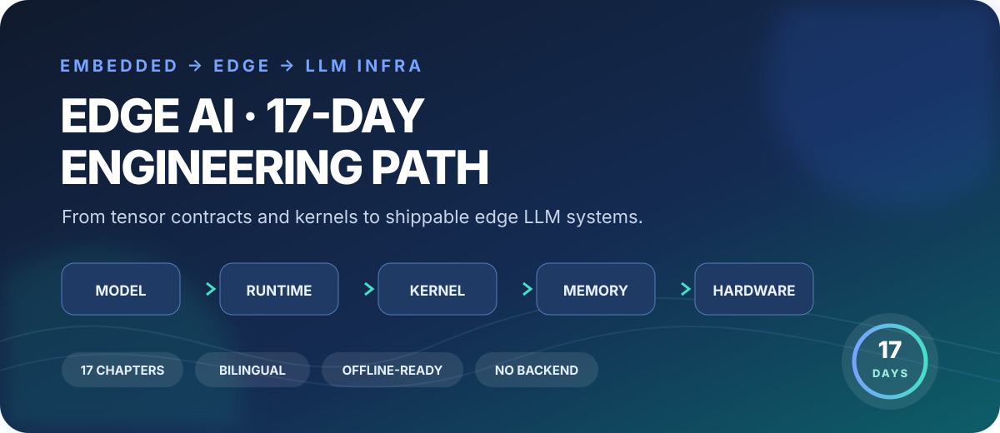

<p align="center">
  
</p>

<h1 align="center">端侧 AI · 17 天工程路线</h1>

<p align="center">
  面向熟悉 ESP32、FreeRTOS、DMA 与网络协议栈的工程师，<br>
  从张量、算子和内存一路走到可交付的端侧 LLM 与大规模 Infra。
</p>

<p align="center">
  <a href="https://leeebo.github.io/learning_ai/"><strong>开始中文课程 →</strong></a>
  &nbsp;·&nbsp;
  <a href="https://leeebo.github.io/learning_ai/en/"><strong>Read in English →</strong></a>
</p>

<p align="center">
  
  
  
  
  
</p>

> 这不是“在 MCU 上硬跑大模型”的速成清单，而是一条尊重设备边界、数据移动与产品 SLO 的完整工程路线。

## 为什么值得学

| 🧭 完整工程链路 | 🧪 每章都能动手 | 🧠 真正形成闭环 | 🌍 双语且离线可读 |
| --- | --- | --- | --- |
| 模型 → 表示 → Runtime → Kernel → 内存/带宽 → 硬件 → 产品 | 历史脉络、类比图解、六步动画、实验、陷阱和三题测验 | 断点续学、错题复习、实验笔记、阶段徽章和随机彩蛋 | 34 个双语章节页完整预渲染，无 JavaScript 仍可读正文 |

课程明确区分三级设备边界：ESP32/MCU 负责传感器、实时 I/O、协议与执行器安全边界；Linux Edge Host、手机、PC 或 SBC 承担实际 LLM 推理；超出本地能力时才显式回退云端。技术事实截至 **2026-08-11** 核验，优先引用论文、官方文档与项目仓库。

## 17 天学什么

| 阶段 | 章节 | 你将建立的能力 |
| --- | --- | --- |
| **01 · 模型基础** | Day 1–5 | 张量契约、训练/推理、模型格式、量化、算子与融合 |
| **02 · 端侧数据流** | Day 6–10 | ESP32 部署、内存/带宽预算、视觉流水线、Tokenizer 与 KV Cache |
| **03 · 可交付系统** | Day 11–15 | Runtime 分工、GGUF、后端 fallback、性能功耗分析与系统验收 |
| **04 · LLM Infra** | Day 16–17 | 从芯片到集群，再把大规模 Infra 经验迁移到设备约束 |

<details>
<summary><strong>展开全部 17 章目录</strong></summary>

1. 神经网络基础与张量契约
2. 训练、推理与模型导出
3. ONNX、LiteRT、GGUF 等模型格式
4. 端侧量化与校准
5. 算子、Kernel、布局与融合
6. 非 LLM 小模型的训练和 ESP32 部署
7. 内存、带宽、MCU/NPU 预算
8. 摄像头和端侧视觉流水线
9. Tokenizer 与聊天模板
10. KV Cache、Prefill 与 Decode
11. LLM Runtime 与 ESP32/Host 分工
12. LLM 量化与 GGUF
13. 推理框架、后端与 fallback
14. 性能、功耗与尾延迟分析
15. 端侧 AI 系统整合与验收
16. 大规模 LLM Infra：从芯片到集群
17. 端侧 LLM Infra：从云端经验到设备约束

</details>

每章的三题测验全对后，会从该章独立的本地化奖励池中随机解锁一个页面彩蛋；17 章的奖励主题各不相同。

## 学习体验不是“读完即忘”

启用 JavaScript 时，网站会在当前浏览器中维护学习状态：

| 功能 | 学习价值 |
| --- | --- |
| **断点续学 + 阅读进度** | 回到上次位置，长章节也不迷路 |
| **全文课程搜索** | 按主题、关键词或工程问题定位章节 |
| **错题复习** | 自动收集答错题目，答对后从下一轮移除 |
| **实验笔记 + Markdown 导出** | 用统一模板保留设备、版本、命令、实测与结论 |
| **阶段徽章 + 连续学习** | 把 17 天拆成清晰、可完成的里程碑 |
| **随机章节彩蛋** | 每次全对都有一份属于该章的小奖励 |
| **学习档案导入 / 导出** | 用经过校验的 JSON 在浏览器之间迁移进度、错题和笔记 |
| **完课纪念证书** | 17 章全部满分后解锁，可打印或保存为 PDF |

这些数据只使用版本化的 `localStorage` 键保存在当前浏览器：**不上传、不追踪、不要求账号**。你可以主动导出学习档案进行备份；清理站点数据仍会清除尚未导出的进度、错题和实验笔记。完课证书是基于本机记录生成的个人纪念，不是第三方可验证的资质证书。

<p align="center">
  <a href="https://leeebo.github.io/learning_ai/"><strong>现在开始 Day 1</strong></a>
  &nbsp;·&nbsp;
  <a href="https://leeebo.github.io/learning_ai/day16.html"><strong>直接阅读大规模 LLM Infra</strong></a>
  &nbsp;·&nbsp;
  <a href="https://leeebo.github.io/learning_ai/day17.html"><strong>直接阅读端侧 LLM Infra</strong></a>
</p>

---

## 给贡献者

### 本地开发

需要 Node.js 18 或更新版本。

```bash
npm ci
npm run serve
```

Eleventy 会在终端显示本地预览地址。站点配置了 GitHub Project Pages 的 `/learning_ai/` 路径前缀，请从该入口预览页面。

完整验证命令：

```bash
npm run check
```

该命令会检查 JavaScript 语法、构建 Eleventy、同步发布文件并运行双语数据与页面测试。

### 内容与模板

```text
src/
├── _data/
│   ├── course/          # 中英文 17 章课程数据分片
│   ├── courseMeta.cjs   # 总章数、连续编号与技术核验日期
│   └── i18n.cjs         # 两种语言的界面文案
├── _includes/           # 首页、章节、复习页和基础 HTML 模板
├── zh-CN/               # 中文页面入口，发布到站点根路径
├── en/                  # 英文页面入口，发布到 /en/
└── assets/              # 共享交互脚本和样式
```

修改源数据或模板后运行：

```bash
npm run build
npm test
```

`npm run build` 先生成 `_site/`，确认 40 个双语页面和 3 个共享资源完整后，再把 43 个部署文件同步到仓库根目录。根目录的 `index.html`、`review.html`、`certificate.html`、`dayNN.html`、`en/`、`app.js` 和 `styles.css` 都是生成物，不应直接修改。

详细的内容约束、翻译一致性、无障碍要求和新增语言流程见 [AGENTS.md](AGENTS.md)。

### 部署到 GitHub Pages

仓库继续提交构建后的静态文件，因此不需要服务器端运行时：

1. 合并前运行 `npm run check` 并提交同步后的生成文件。
2. 在仓库 `Settings → Pages` 中选择 `Deploy from a branch`。
3. 选择 `master` 分支和 `/(root)` 目录。

发布地址为 <https://leeebo.github.io/learning_ai/>，英文入口为 <https://leeebo.github.io/learning_ai/en/>。
